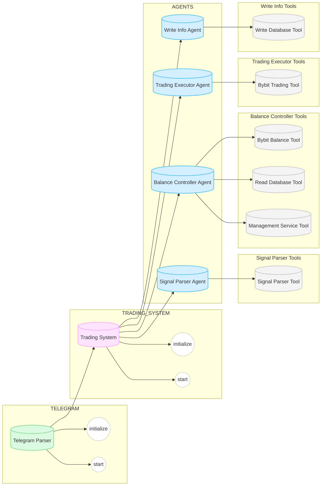

# Crypto Trader Assistant

## Описание проекта 

Проект представляет собой торгового бота на основе агентов для криптовалютной биржи ByBit с управлением риск-менеджментом, разработанного для автоматизации торговли по сигналам из Telegram каналов

## 🎯 Цели проекта
- Оптимальное управление балансом счёта
- Положительный PnL в долгосроке

## 🛠 Технологии

- Основная LLM: 🧠 Qwen2.5:14b-instruct
- Инференс LLM: 🦙 Ollama
- Фреймворк:   Crew AI
- База данных: 🐘 PostgreSQL
- API: ✉️ Telegram API, 📈 Bybit API
- Бекенд: ⚙ FastAPI

## 🗒 Архитектура проекта

## 🤖 Схема агентов:

## ✨ Ключевые фишки

- Интеграция с Telegram каналами: можно подключать несколько каналов с сигналами
- Возможность устанавливать свои ограничения: детальная настройка ограничений системы
- Автономность системы: самостоятельное реагирование системы на входящие сигналы
- Сохранение истории торговли: просмотр совершённых сделок и их анализ
- Автоматический риск-менеджмент: принятие решений с помощью LLM

## ⏰ План работ

1) Валидация проекта
2) Проектирование архитектуры
3) Бэктестинг сигналов из канала Telegram
4) Подготовка прототипа системы агентов
5) Интеграция с сервисами
6) Доработка системы агентов

## 🚀 TODO
- Подключение мониторинга
- Улучшение системы
